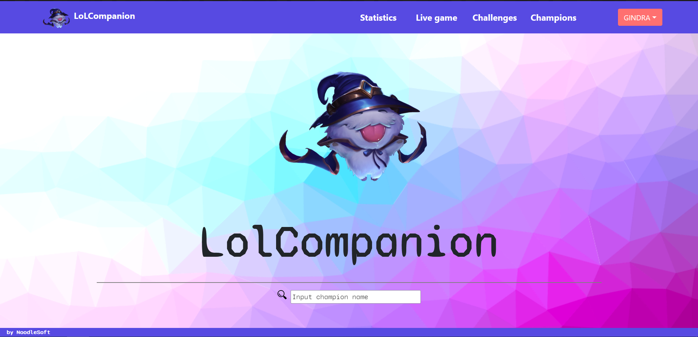
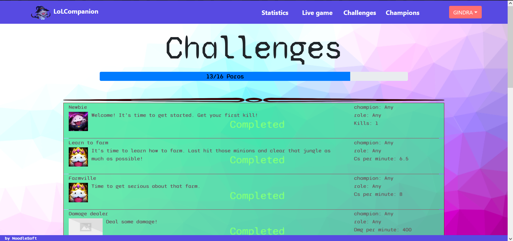

# LolCompanion

Multi-purpose web application serving as a kind of hub for League of Legends players.
Written mostly in PHP using the Codeigniter 4 framework. 
Data is gathered using Riot API(Riot Games, Inc) and a [PHP wrapper by dolejska-daniel](https://github.com/dolejska-daniel/riot-api-datadragon)
Users register on the site using their in-game nicknames
|  |
|:--:|
| *the site after login* |

Features of the web application:
- User's profile:

- - In-game rank
- - Poro bar
- - Win rate of most played champs
- - Match history
- Challenges
	Site moderators create and add challenges that registered users can complete and earn poros!
	Challenges are completed by fulfilling a specific given task in a recent game of LoL.
	As users complete challenges they unlock new ones.
	
	
